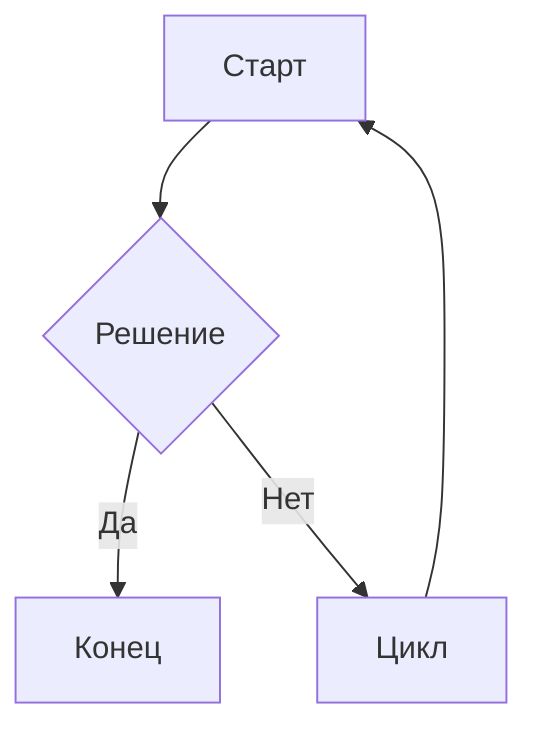

# obsidian-markdown: Obsidian Flavored Markdown

Ссылайся на этот скилл при написании любой wiki-страницы. Obsidian расширяет стандартный Markdown wikilinks, embeds и properties. Неправильный синтаксис ломает ссылки или frontmatter молча.

---

## Wikilinks

Внутренние ссылки используют двойные скобки. Имя файла без расширения.

| Синтаксис                 | Что делает                     |
| ------------------------- | ------------------------------ |
| `[[Note Name]]`           | Базовая ссылка                 |
| `[[Note Name\|Текст]]`    | Алиас (показывает "Текст")     |
| `[[Note Name#Заголовок]]` | Ссылка на конкретный заголовок |
| `[[Note Name#^block-id]]` | Ссылка на конкретный блок      |

Правила:
- Чувствительно к регистру в некоторых системах. Совпадение должно быть точным.
- Путь не нужен: Obsidian резолвит по уникальности имени файла.
- Если два файла имеют одинаковое имя, используй `[[Folder/Note Name]]` для disambiguation.
- Для внешних ссылок используй нативный формат markdown: [link](url).

---

## Embeds

Embeds используют `!` перед wikilink. Отображают содержимое inline.

| Синтаксис | Что делает |
|---|---|
| `![[Note Name]]` | Встроить полную заметку |
| `![[Note Name#Заголовок]]` | Встроить секцию |
| `![[image.png]]` | Встроить изображение |
| `![[image.png\|300]]` | Изображение шириной 300px |
| `![[document.pdf]]` | Встроить PDF (Obsidian рендерит нативно) |
| `![[audio.mp3]]` | Встроить аудио |

---

## Properties (Frontmatter)

Obsidian рендерит YAML frontmatter как панель Properties. Правила:

```yaml
---
type: idea                       # plain string
title: "Название заметки"        # в кавычках если содержит спецсимволы
created: 2026-04-29              # дата как YYYY-MM-DD (не ISO datetime)
updated: 2026-04-29
tags:
  - tag-one                      # список через `- `
  - tag-two
status: in-progress
related:
  - "[[Другая заметка]]"         # wikilinks в YAML обязательно в кавычках
sources:
  - "[[source-page]]"
---
```

Правила:
- Только плоский YAML. Никаких вложенных объектов.
- Даты как `YYYY-MM-DD`, не `2026-04-08T00:00:00`.
- Списки через `- элемент`, не inline `[a, b, c]`.
- Wikilinks в YAML должны быть в кавычках: `"[[Page]]"`.
- Поле `tags`: Obsidian читает как tag list, поиск работает по vault.

---

## Теги

Две валидные формы:

```markdown
#tag-name             - inline тег где угодно в теле
#parent/child-tag     - вложенный тег (показывает иерархию в tag pane)
```

Во frontmatter:
```yaml
tags:
  - research
  - ai/obsidian
```

Не используй `#` внутри списка тегов во frontmatter. Только имя тега.

---

## Форматирование текста

Стандартный Markdown плюс расширения Obsidian:

| Синтаксис | Результат |
|---|---|
| `**bold**` | **жирный** |
| `*italic*` | *курсив* |
| `~~strikethrough~~` | зачёркнутый |
| `==highlight==` | выделенный (жёлтый в Obsidian) |
| `` `inline code` `` | inline код |

---

## Math

Obsidian использует MathJax/KaTeX:

Inline math:
```markdown
$E = mc^2$
```

Block math:
```markdown
$$
\int_0^\infty e^{-x} dx = 1
$$
```

---

## Code blocks

Стандартные fenced code blocks. Obsidian подсвечивает все основные языки:

````markdown
```python
def hello():
    return "world"
```
````

---

## Таблицы

Стандартные Markdown-таблицы:

```markdown
| Колонка A | Колонка B | Колонка C |
|-----------|-----------|-----------|
| Значение  | Значение  | Значение  |
```

Obsidian рендерит таблицы нативно. Плагин не нужен.

---

## Mermaid диаграммы

Obsidian рендерит Mermaid нативно:

````markdown

````

Поддерживаются: `graph`, `sequenceDiagram`, `gantt`, `classDiagram`, `pie`, `flowchart`.

---

## Footnotes

```markdown
Это предложение со сноской.[^1]

[^1]: Текст сноски здесь.
```

---

## Чего НЕ делать

- Не используй `[текст](path/to/note.md)` для внутренних ссылок: используй `[[Note Name]]`.
- Не используй HTML — только Markdown.
- Не пиши `tags: [a, b, c]` inline во frontmatter: Obsidian предпочитает list-формат.
- Не пиши ISO datetimes во frontmatter (`2026-04-08T00:00:00Z`): используй `2026-04-08`.
