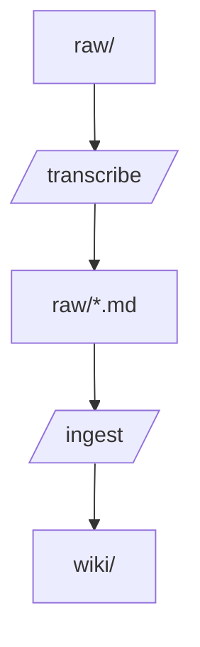

# llm-wiki — состояние проекта

Документ полностью описывает текущее состояние проекта `llm-wiki`. Поддерживается параллельно с разработкой и используется как материал для ВКР.

**Дата последнего обновления:** 2026-05-01
**Текущий HEAD:** `(embeddings branch — Этап 11)`

---

## 1. Назначение и базовый паттерн

`llm-wiki` — это **Obsidian-vault, управляемый через Claude Code**. Проект реализует паттерн **LLM Wiki**: персистентная, накапливающаяся база знаний для пары Claude + Obsidian. Идея — заменить retrieval-augmented generation (RAG) на статически синтезированную, перекрёстно-слинкованную базу знаний, которая накапливается со временем.

**Ключевое отличие от RAG:**
- RAG: каждый запрос → embedding-search по сырым документам → синтез ответа
- LLM Wiki: ingest источника → один раз делаем синтез → накопленная wiki содержит готовые перекрёстные ссылки, помеченные противоречия, домены, цитаты. На последующих запросах синтез уже сделан — Claude читает структурированные страницы.

Знание накапливается по принципу сложного процента: каждый новый источник встраивается в существующие страницы (обогащает или порождает противоречия), а не остаётся изолированным фрагментом.

---

## 2. Структура репозитория

```
llm-wiki/
├── CLAUDE.md                      ← инструкции для Claude Code
├── PROJECT.md                     ← этот документ (полное состояние проекта)
├── README.md
├── .gitignore
│
├── raw/                           ← Уровень 1: иммутабельные источники
│   ├── formats/                   ← бинарные оригиналы (PDF, DOCX, audio, video)
│   ├── meta/
│   │   └── ingested.json          ← манифест (sha256 оригинала + транскрипта)
│   ├── RLHF.md                    ← пример источника в markdown
│   └── paper.md                   ← пример транскрипта (после /transcribe)
│
├── wiki/                          ← Уровень 2: LLM-генерируемая база знаний
│   ├── index.md                   ← мастер-каталог (таблицы со саммари)
│   ├── log.md                     ← хронологический журнал операций
│   ├── cache.md                   ← кэш недавнего контекста (~500 слов)
│   ├── summary.md                 ← обзор всей wiki (счётчики, темы)
│   │
│   ├── ideas/                     ← концепции, механизмы, теории
│   ├── entities/                  ← люди, организации, продукты, статьи, модели
│   ├── questions/                 ← сохранённые ответы и синтезы
│   ├── domains/                   ← навигационные хабы (MOC) для кластеризации
│   └── meta/                      ← инфраструктура
│       ├── embeddings.json        ← wiki page embeddings (ключ — basename)
│       ├── dashboards/            ← Obsidian Bases (.base файлы)
│       │   ├── dashboard.base     ←   общий dashboard
│       │   └── <Domain>.base      ←   per-domain views
│       ├── lint-reports/          ← lint state + версионированные отчёты
│       │   ├── lint-state.json    ←   состояние lint (hash + open_issues)
│       │   └── lint-report-*.md   ←   опциональные снимки
│       └── kn-maps/               ← knowledge map snapshots
│           └── knowledge-map-*.md ←   versioned (по дате)
│
├── _templates/                    ← Obsidian Templater
│   ├── idea.md
│   ├── entity.md
│   ├── question.md
│   └── domain.md
│
├── _attachments/                  ← изображения, PDF (для ![[embed]])
│
├── .claude/                       ← Уровень 3: инструкции и конфигурация Claude
│   ├── settings.json              ← permissions + hooks
│   ├── agents/                    ← кастомные subagent'ы (пусто)
│   ├── commands/                  ← кастомные slash-команды (пусто)
│   └── skills/
│       ├── wiki/                  ← маршрутизатор + frontmatter-схема
│       ├── ingest/                ← синтез источников (8-фазный workflow)
│       ├── query/                 ← запросы к wiki (3 режима)
│       ├── lint/                  ← read-only ревьюер (two-layer)
│       ├── transcribe/            ← конвертация PDF/DOCX/audio/video в markdown
│       ├── save/                  ← файлирование разговоров
│       ├── defuddle/              ← очистка URL → дословный markdown
│       ├── obsidian-markdown/     ← reference: Obsidian Flavored Markdown
│       └── obsidian-bases/        ← reference: Obsidian Bases (.base files)
│
├── .obsidian/                     ← конфигурация Obsidian
│   ├── app.json
│   ├── appearance.json
│   ├── core-plugins.json
│   ├── community-plugins.json
│   ├── graph.json                 ← фильтр графа (исключает meta/raw)
│   ├── themes/                    ← Claudian, Meridian, Minimal
│   └── plugins/                   ← brat, claudian, terminal
│
└── bin/                           ← скрипты обслуживания
    ├── lint.py                    ← Layer 1 + 1.5 lint (16 detect + 2 embedding-based)
    ├── embed.py                   ← embedding service (Ollama HTTP, EmbedIndex, CLI)
    ├── transcribe.py              ← Step 1 pipeline: PDF/DOCX/audio/video → raw markdown
    ├── tests/                     ← pytest: 180 тестов (lint + embed)
    │   ├── test_lint.py           ← 99 тестов всех check'ов и хелперов
    │   └── test_embed.py          ← 63 теста vector math, EmbedIndex, Ollama mocking
    ├── requirements.txt           ← Python-зависимости (pymupdf4llm + pytest)
    ├── setup.sh                   ← установка всех зависимостей (incl. whisper-cpp, ffmpeg)
    └── setup-vault.sh             ← (legacy)
```

Уровневая модель из CLAUDE.md:
- **Уровень 1 (`raw/`):** Claude **только читает**. Никогда не модифицирует.
- **Уровень 2 (`wiki/`):** Claude **владеет** и модифицирует через скиллы.
- **Уровень 3 (`.claude/`, `CLAUDE.md`):** инструкции, схемы, шаблоны.

---

## 3. Структура wiki/ (плоская универсальная)

Все content-страницы делятся на **четыре типа**, каждый в своей папке. Тематических подпапок **нет** — кластеризация по темам идёт через теги и поле `domain` во frontmatter.

| Папка | Тип | Назначение |
|---|---|---|
| `wiki/ideas/` | `idea` | Концепции, механизмы, теории, паттерны (RLHF, PPO, Advantage Function) |
| `wiki/entities/` | `entity` | Именованные объекты: люди, организации, продукты, статьи, модели (InstructGPT, Ziegler 2019) |
| `wiki/questions/` | `question` | Сохранённые ответы на конкретные запросы и синтезы |
| `wiki/domains/` | `domain` | Навигационные хабы (Map of Content). Создаются по предложению скилла после набора N=10 страниц с одним тегом |

`wiki/meta/` — служебная папка: dashboard, lint-отчёты, state-файлы (frontmatter `type: meta`).

Корневые служебные файлы wiki/:
- `index.md` — мастер-каталог в формате таблиц `| Страница | Суть |` (одна строка саммари ≤120 символов)
- `log.md` — хронологический журнал ingest/save/domain-операций (новые записи сверху)
- `cache.md` — недавний контекст (~500 слов): последнее обновление, ключевые факты, активные темы. Перезаписывается целиком после каждой операции.
- `summary.md` — обзор всей базы: счётчики страниц по типам, активные темы, распределение тегов

---

## 4. Frontmatter-схема

Полная спецификация — `.claude/skills/wiki/references/frontmatter.md`. Здесь — выжимка.

### Универсальные поля (для всех content-типов)

```yaml
---
type: <idea|entity|question|domain|meta>
created: YYYY-MM-DD
updated: YYYY-MM-DD
tags:
  - <Тематический-Тег>
status: <evaluation|in-progress|ready>
domain:
  - "[[Domain Page]]"
related:
  - "[[Другая страница]]"
sources:
  - "[[raw/articles/source-file.md]]"
---
```

### Принципиальные правила схемы

1. **Заголовок страницы — только в имени файла и H1 тела.** Поле `title` во frontmatter **не используется** (исключение — `meta`-страницы для отображаемого имени служебного файла).
2. **`status` принимает строго одно из:** `evaluation`, `in-progress`, `ready`. Никаких `stable`, `draft`, `done`.
3. **Для `type: entity` поле `status` не используется** — entity это факт, у него нет состояния готовности.
4. **Регистр тегов:**
   - Аббревиатуры заглавными: `ML`, `RL`, `NLP`, `RLHF`, `LLM`, `LoRA`, `GAN`, `VAE`
   - Обычные слова с заглавной первой буквы: `Alignment`, `Reinforcement-Learning`, `Optimization`
   - Никаких lowercase-аббревиатур
5. **`sources` ссылается только на файлы из `raw/`. Эти ссылки не дублируются в теле страницы.** Никаких упоминаний `[[raw/...]]` в нарративе или в секциях типа "## Источники".
6. **Только плоский YAML.** Никаких вложенных объектов (требование Obsidian Properties UI).
7. **Wikilinks в YAML обязательно в кавычках:** `"[[Страница]]"`.

### Тип-специфичные поля

**`idea`:**
```yaml
aliases:
  - "альтернативное название"
  - "аббревиатура"
```

**`entity`:**
```yaml
entity_type: person   # person | organization | product | repository | place | paper | model | dataset
role: ""
```

**`question`:**
```yaml
question: "Оригинальный запрос"
answer_quality: solid  # draft | solid | definitive
```

**`domain`:** дополнительных полей не требуется. Имя файла и `tags` определяют домен.

**`meta`:** минимальный frontmatter, единственный тип где допустим `title`:
```yaml
---
type: meta
title: "Кэш контекста"
updated: YYYY-MM-DD
---
```

### Удалённые поля (наследие)

В ходе рефакторинга (коммит `565376c`) удалены из всех типов:
- `title` — дублировало имя файла
- `complexity` (на `idea`) — субъективная оценка
- `first_mentioned` (на `entity`) — дублировало `created` при первом ingest
- `status` (на `entity`) — нет смысла

---

## 5. Скиллы

Все скиллы — это `.claude/skills/<name>/SKILL.md` файлы с YAML-frontmatter, описывающим триггеры и инструменты. Claude Code автоматически подгружает их по имени при упоминании или вызове slash-команды.

### 5.1 wiki — маршрутизатор

**Файл:** `.claude/skills/wiki/SKILL.md` (142 строки)

Высокоуровневый orchestrator. Не выполняет операций сам — маршрутизирует к под-скиллам по интенту пользователя:

| Пользователь сказал | Операция | Под-скилл |
|---|---|---|
| "ingest [источник]", `/ingest` | INGEST | `ingest` |
| "что ты знаешь о X", `/query` | QUERY | `query` |
| "lint", `/lint` | LINT | `lint` |
| "сохрани это", `/save` | SAVE | `save` |

Также описывает архитектуру (3 уровня), структуру `wiki/`, формат cache.md, кросс-проектное использование (как читать эту wiki из других Claude Code-проектов).

### 5.2 ingest — синтез источников (8-фазный workflow)

**Структура (router + references):**
```
.claude/skills/ingest/
├── SKILL.md                    ~120 строк — точка входа, роутинг
└── references/
    ├── dedup.md                ~75 строк — manifest и hash-проверки
    ├── url-ingestion.md        ~90 строк — defuddle flow
    ├── synthesis-phases.md     ~280 строк — фазы 1-7 детально
    └── lint-fix.md             ~125 строк — Phase 8 + Fix-only mode
```

`SKILL.md` подгружается Claude'ом при триггере. Reference-документы — по нужде, что экономит токены при простых операциях (например, `/ingest --fix` грузит только `lint-fix.md`).

Самый сложный скилл. Берёт raw-источник → строит карту знания → решает гранулярность → создаёт/обновляет страницы → связывает через wikilinks и frontmatter.

#### Команды

| Команда | Поведение |
|---|---|
| `/ingest [источник]` | Стандартный режим: прочитать → обсудить → синтезировать |
| `/ingest --auto [источник]` | Без обсуждения, сразу синтез |
| `/ingest --force [источник]` | Игнорировать source-level дедуп |
| `/ingest --fix` | Без источника: применить open_issues из lint-state.json |
| `/ingest [несколько источников]` | Batch mode |

#### Source-level дедуп (`raw/meta/ingested.json`)

Перед каждым ingest:
1. Считает `sha256` источника
2. Смотрит запись по ключу `raw/<path>` в `ingested.json`
3. Если path+hash совпадают → skip с сообщением (`/ingest --force` обходит)
4. Иначе — продолжает synthesis, после успеха обновляет manifest

Структура записи:
```json
{
  "sources": {
    "raw/RLHF.md": {
      "hash": "<sha256>",
      "ingested_at": "2026-04-29T15:45:00",
      "pages_created": ["wiki/ideas/RLHF.md", ...],
      "pages_updated": ["wiki/index.md", ...]
    }
  }
}
```

Pattern взят из референсного проекта `claude-obsidian` (`.raw/.manifest.json`).

#### URL и image ingestion

- **URL** (`https://...`) → дедуп по `source_url` в `ingested.json` → `defuddle parse [url] --markdown` (дословный текст с сохранёнными картинками-ссылками и LaTeX-формулами) → save to `raw/articles/[slug]-[YYYY-MM-DD].md` с frontmatter (`source_url`, `fetched`) → продолжить synthesis. Hash для дедупа считается **только от тела** без frontmatter, чтобы тот же URL без изменений на странице давал тот же hash независимо от даты.
- **Image** (`.png`/`.jpg`/...) → Read native → описать → save to `raw/images/[slug]-[YYYY-MM-DD].md` → копия в `_attachments/` → продолжить

#### 8 фаз synthesis workflow

| Фаза | Назначение |
|---|---|
| 1. Прочитать источник | Полное чтение, без скимминга. Понимание структуры знания. |
| 2. Карта знания | Явный список концепций / сущностей / утверждений. Без этого ingest деградирует в "пересказ". |
| 3. Решение по гранулярности | Для каждой единицы — будет ли своя страница. Критерии ниже. |
| 4. Написать или обновить | Создать новую (по шаблону) или дополнить существующую (новая секция / уточнение / противоречие). |
| 5. Связать страницы | frontmatter (sources/related/tags/domain) + inline wikilinks при первом упоминании. |
| 6. Инфраструктура | Обновить index.md (вставить строки в таблицы), log.md (новая запись сверху), cache.md (перезаписать), summary.md (счётчики). |
| 7. Domain proposal | Если тег ≥10 страниц и нет domain-страницы → предложить создать. По согласию — создать MOC + back-fill `domain:` на всех тегированных страницах. |
| 8. Lint review | Вызвать `lint` (read-only) → прочитать `open_issues` → применить auto-fix молча, спросить ask-issues батчем, оставить skip. Пере-хешировать wiki, перезаписать `lint-state.json`. |

#### Критерии гранулярности (Phase 3)

**Idea получает свою страницу если хотя бы одно из:**
- Общая концепция — существует независимо от домена источника (Advantage Function существует в любом RL, не только в RLHF)
- Будет переиспользоваться — ≥2 независимых страниц-ссылки
- Самодостаточно объяснима — не требует контекста родителя

Иначе — параграф в наиболее релевантной родительской странице со ссылкой на общую концепцию (если такая есть).

**Entity получает свою страницу если хотя бы одно из:**
- Центральна для понимания источника
- Будет упоминаться в других источниках/страницах
- Несёт собственную информацию (не упомянута мимоходом)

#### Domain proposal (Phase 7)

Триггер — тег T присутствует на ≥10 страницах И нет domain-страницы. Скилл предлагает в свободной форме:

```
📍 Тег `ML` теперь на 12 страницах. Создать domain-страницу
   "Machine Learning" и связать её с этими страницами?
```

При согласии:
1. Создать `wiki/domains/<Title>.md` из шаблона
2. Заполнить описание + 3-5 ключевых концепций + Bases-запрос (`filters: domain contains "[[<Title>]]"`)
3. Back-fill `domain: ["[[<Title>]]"]` на всех страницах с этим тегом
4. Запись в log.md, обновить index.md, cache.md

При отказе ничего не сохраняется — следующий ingest предложит снова.

### 5.3 query — запросы (3 режима)

**Файл:** `.claude/skills/query/SKILL.md` (187 строк)

Отвечает на вопросы из накопленной wiki. Стратегия: читать минимум необходимого, идти от дешёвого к дорогому.

#### Режимы

| Команда | Режим | Что читает | Токенов |
|---|---|---|---|
| `/query --quick [вопрос]` | Quick | cache + index | ~1500 |
| `/query [вопрос]` | Standard | cache + index + (опц. domain) + 3-5 страниц | ~3000 |
| `/query --deep [вопрос]` | Deep | вся wiki + опц. web | ~8000+ |

#### Иерархия чтения

```
1. cache.md          ~500 ток.   недавний контекст
   ↓
2. index.md          ~1000 ток.  таблицы (страница + саммари)
   ↓ если вопрос локализован в одной области
3. domains/<X>.md    ~500 ток.   локальный MOC
   ↓
4. отдельные страницы 100-300 ток. только релевантные по саммари
```

`domains/<X>.md` как локальный индекс разгружает главный index, когда вопрос целиком в одной области.

#### Файлирование ответов

Хорошие ответы предлагается сохранить как `wiki/questions/<title>.md`. Frontmatter включает `question:`, `answer_quality`, `related`, `sources`.

### 5.4 lint — read-only ревьюер (three-layer)

**Файлы:**
- `bin/lint.py` (~1200 строк Python) — Layer 1 + Layer 1.5
- `bin/embed.py` — embedding service (используется Layer 1.5)
- `.claude/skills/lint/SKILL.md` — Layer 2: LLM-семантические проверки

**Архитектура three-layer.**

**Layer 1** (детерминистический): 18 типов программных проверок без LLM — статус enum, поля схемы, регистр тегов, сироты, мёртвые ссылки, dangling-domain-ref, asymmetric-related, структура index, бинарные источники вне formats, **non-canonical-wikilink** (path-prefixed wikilinks вместо basename), **domain-order** (порядок доменов от частного к общему). Запускается за секунды.

**Layer 1.5** (embedding-based, опционально через `--approx`): два типа semantic-проверок на pre-computed эмбеддингах:
- `similar-but-unlinked` — пары страниц с высоким cosine но без wikilink (missing connections в графе знания)
- `synthesis-drift` — wiki-страницы, чей embedding далеко от центроида эмбеддингов источников (детектор галлюцинаций синтеза)

Оба порога адаптивные (по перцентилю/std распределения), плюс абсолютные floor-значения (cosine ≥ 0.6, drift ≥ 0.1) — защита от ложных срабатываний на «плоских» распределениях. Ollama не нужна для запуска lint — только pre-computed `embeddings.json`.

**Layer 2** (LLM-семантический): требует языкового суждения — `contradiction`, `outdated-claim`, `missing-concept`, плюс `style-nit` (skip-категория).

Полный поток `/lint`:
```
1. python3 bin/lint.py [--approx]   # Layer 1 (+ 1.5 если --approx)
2. lint skill (LLM)                  # Layer 2
```

Флаги:
- `--fast` — пропускает Layer 2
- `--approx` — добавляет Layer 1.5
- `--similarity-percentile / --drift-std` — тонкая настройка порогов

**Только читает.** Записывает результат в `wiki/meta/lint-reports/lint-state.json`. Никогда не модифицирует content-файлы.

#### Команды

| Команда | Поведение |
|---|---|
| `/lint` | Skip-check по hash; если не чисто — full audit |
| `/lint --force` | Игнорировать skip-check |

#### Skip-check (агрегатный hash)

`wiki/meta/lint-reports/lint-state.json`:
```json
{
  "wiki_hash": "<sha256 от всех wiki/**/*.md>",
  "last_audit": "2026-04-29T15:45:00",
  "files_checked": 11,
  "open_issues": [
    {"type": "dead-link", "where": "wiki/ideas/RLHF.md", "what": "[[SFT]]"}
  ]
}
```

Логика:
- Считаем текущий agg-hash всех `wiki/**/*.md` (целые файлы, с frontmatter — lint проверяет именно frontmatter)
- Совпадает с сохранённым И `open_issues` пуст → пропуск, "wiki не менялась"
- Совпадает И `open_issues` не пуст → не аудитим заново, **показываем сохранённые** issues + предлагаем `/ingest --fix`
- Не совпадает → full audit, перезапись state

#### Категории issues

Каждый issue имеет `type`. По типу `ingest` решает, как поступить:

**Auto-fix** (детерминистические нарушения схемы — единственный очевидный fix):
- `status-not-in-enum`, `status-on-entity`, `legacy-field`, `lowercase-tags`, `inline-tags`, `raw-link-with-extension`, `raw-ref-in-body`, `empty-sources-section`
- `folder-type-mismatch` — папка vs `type:` во frontmatter рассогласованы (фикс по папке)
- `stale-index-entry` — строка в `index.md` ведёт на удалённую страницу (фикс — удалить строку)

**Ask user** (требует суждения):
- `dead-link`, `orphan`, `missing-concept` (≥3 упоминания), `contradiction`, `outdated-claim`
- `missing-index-entry` — страница есть, в index нет (фикс — сгенерировать саммари и добавить строку)
- `dangling-domain-ref` — `domain:` указывает на несуществующую domain-страницу (создать или убрать)
- `asymmetric-related` — A→B без B→A (симметризовать или удалить одностороннюю)

**Skip** (информационные флаги, не спрашиваем):
- `empty-section`, `style-nit`

#### Что lint никогда не делает

- Не правит content-файлы. Никогда.
- Не создаёт стаб-страницы (это всегда в категории `ask`)
- Не удаляет файлы
- Не разрешает противоречия

### 5.5 save — файлирование разговоров

**Файл:** `.claude/skills/save/SKILL.md` (145 строк)

Берёт текущий разговор/инсайт и файлирует как wiki-страницу.

| Команда | Поведение |
|---|---|
| `/save` | Спросить название |
| `/save [название]` | С указанным названием |
| `/save type:<тип>` | Принудительный тип |

Workflow:
1. Просканировать разговор — выделить ценное
2. Спросить название (если не указано)
3. Определить тип по содержанию (idea/entity/question/domain)
4. Проверить дубли через Glob/Grep
5. Извлечь содержимое в декларативном настоящем времени
6. Создать с frontmatter из шаблона
7. Собрать ссылки в `related`
8. Обновить index.md (вставить строку в таблицу)
9. Дописать в log.md
10. Обновить cache.md

### 5.6 transcribe — конвертация бинарных источников в markdown

**Структура:**
```
.claude/skills/transcribe/
├── SKILL.md                       ← router: триггеры, флаги, правила агента
└── references/
    ├── raw-pipeline.md            ← Step 1/2, форматы, изображения, именование
    └── wiki-integration.md        ← frontmatter, sources, dedup, ingest-routing
```

#### Поддерживаемые форматы

| Формат | Библиотека | Изображения | Транскрипт |
|---|---|---|---|
| `.pdf` | pymupdf | ✓ | — |
| `.docx` | pandoc | ✓ | — |
| `.mp3/.wav/.m4a/.ogg/.flac` | ffmpeg → whisper-cpp | — | ✓ |
| `.mp4/.mov/.mkv/.webm` | ffmpeg → whisper-cpp | — | ✓ |

#### Two-step pipeline (PDF/DOCX)

1. **Step 1а — `bin/transcribe.py`**: запускается через Bash без LLM. Для PDF: `pymupdf` извлекает изображения (bounding-box рендеринг, стратегия raster vs vector). Для DOCX: `pandoc --extract-media`. Изображения падают в `_attachments/`, скрипт выводит JSON-манифест в stdout.

2. **Step 1б — Read tool**: агент читает оригинальный PDF нативно через multimodal Read. Это критично — позволяет корректно видеть формулы LaTeX, таблицы и текст сканов (лучше любой OCR-библиотеки).

3. **Step 2 — агентское восстановление**: агент пишет финальный markdown дословно по оригиналу: структура, формулы (`$...$`, `$$...$$`), таблицы, списки, жирный/курсив, ссылки. Изображения из манифеста встраиваются через `![[img.png]]`. **Запрещено** сокращать, перефразировать, добавлять комментарии. Для PDF > 100 страниц Step 2 пропускается.

#### Audio/video pipeline

```
raw/formats/lecture.mp3
         ↓
bin/transcribe.py  →  ffmpeg: → 16 kHz mono WAV  →  whisper-cpp  →  _attachments/lecture.transcript.txt
         ↓
Манифест: { "transcript": "_attachments/lecture.transcript.txt" }
         ↓
Step 2: агент читает транскрипт через Read, структурирует на разделы (## заголовки по теме),
        расставляет абзацы, исправляет ошибки распознавания, убирает слова-паразиты.
        Сохраняет raw/lecture.md.
```

Для видео ffmpeg прозрачно извлекает аудиодорожку — дальше идентично аудио.

Модель whisper-cpp задаётся через `$WHISPER_MODEL` (путь к `ggml-*.bin`). По умолчанию: `~/models/ggml-base.bin`.

#### Файловая структура

```
raw/formats/paper.pdf           ← оригинал (иммутабельный)
raw/paper.md                    ← восстановленный markdown
_attachments/paper-p0-img0.png  ← изображения из PDF
_attachments/lecture.transcript.txt  ← сырой транскрипт аудио
```

**Frontmatter транскрипта:**
```yaml
source_type: pdf   # или docx / mp3 / mp4 / …
original_file: raw/formats/paper.pdf
restored: true
restored_at: 2026-05-01T10:30:00
pages: 26
```

**В `sources:` wiki-страниц** — только `[[raw/paper]]`. Оригинальный бинарник не вставляется — он не рендерится в Obsidian.

**Дедуп**: простой файловый (mtime) — если `raw/<stem>.md` существует и новее оригинала → skip. `--force` обходит.

Вызывается самостоятельно (`/transcribe raw/formats/paper.pdf`) или автоматически из `ingest` при обнаружении бинарного формата.

#### Команды

| Команда | Поведение |
|---|---|
| `/transcribe <file>` | Полный pipeline: Step 1 + Step 2 |
| `/transcribe --no-restore <file>` | Только Step 1 (для больших документов) |
| `/transcribe --ingest <file>` | Pipeline + автоматически `/ingest` на результате |

### 5.7 Генерация схем и графиков

Claude умеет создавать визуальный контент двумя способами без дополнительных плагинов:

#### Mermaid (схемы — встроено в Obsidian)

Любой блок ` ```mermaid ` рендерится Obsidian нативно. Поддерживаемые типы:
- `flowchart` / `graph` — блок-схемы, пайплайны, архитектурные диаграммы
- `sequenceDiagram` — взаимодействие агентов, API-сценарии
- `classDiagram` — структуры данных, схемы классов
- `gantt` — временные линии
- `pie` — круговые диаграммы

Пример (встраивается в любую wiki-страницу):
```

```

#### Matplotlib / plotlib (графики данных — через Bash)

Если нужен настоящий растровый график: Claude пишет Python-скрипт, запускает через Bash tool, сохраняет `_attachments/<name>.png`, затем встраивает через `![[name.png]]` в нужную wiki-страницу.

Подходит для: гистограмм, scatter plot, кривых обучения, дистрибуций.

#### Когда какой использовать

| Задача | Инструмент |
|---|---|
| Архитектурная схема, пайплайн | Mermaid |
| Граф зависимостей, иерархия | Mermaid |
| График данных (числа, кривые) | matplotlib → PNG |
| Диаграмма последовательности | Mermaid sequenceDiagram |

---

### 5.8 defuddle — очистка URL для ingestion

**Файл:** `.claude/skills/defuddle/SKILL.md`

CLI-обёртка над утилитой [defuddle](https://github.com/kepano/defuddle) (от kepano, на базе Mozilla Readability + custom-чистильщики). Используется в URL ingestion как **единственный** инструмент очистки.

**Что делает:**
- Принимает URL → возвращает markdown с дословным текстом статьи
- Сохраняет: текст, заголовки, списки, таблицы, code blocks, формулы LaTeX, ссылки на картинки
- Удаляет: nav, sidebar, ads, cookie banners, footer, share-кнопки, related articles, скрипты

**Что НЕ делает:** не суммаризирует, не интерпретирует. Чистый strip + HTML→markdown.

**Установка:** `npm install -g defuddle`. Зависимость от Node.js. Защищает проект от использования Anthropic-овского WebFetch, который возвращает суммаризацию вместо дословного текста.

### 5.9 obsidian-markdown — reference

**Файл:** `.claude/skills/obsidian-markdown/SKILL.md` (188 строк)

Референс по корректному Obsidian Flavored Markdown: wikilinks, embeds, properties, теги, math, таблицы, mermaid. Используется другими скиллами при создании страниц.

### 5.10 obsidian-bases — reference

**Файл:** `.claude/skills/obsidian-bases/SKILL.md` (299 строк)

Референс по Obsidian Bases (`.base` файлы): нативный database-слой Obsidian для динамических таблиц, card/list views, фильтров, формул. Применяется в `wiki/meta/dashboards/dashboard.base` и в `wiki/domains/<X>.md` (для подтягивания всех страниц домена).

---

## 6. Шаблоны (`_templates/`)

Используются Obsidian Templater при создании новых страниц. Все шаблоны содержат `<% tp.file.title %>` и `<% tp.date.now("YYYY-MM-DD") %>` placeholder'ы.

### `_templates/idea.md`

```yaml
---
type: idea
aliases: []
created: <% tp.date.now("YYYY-MM-DD") %>
updated: <% tp.date.now("YYYY-MM-DD") %>
tags: []
status: evaluation
domain: []
related: []
sources: []
---

# <% tp.file.title %>

## Суть
## Контекст
## Применение
## Связи
```

### `_templates/entity.md`

```yaml
---
type: entity
entity_type: person
role: ""
created: <% tp.date.now("YYYY-MM-DD") %>
updated: <% tp.date.now("YYYY-MM-DD") %>
tags: []
domain: []
related: []
sources: []
---

# <% tp.file.title %>

## Кто это
## Чем занимается
## Связь с другими сущностями
```

### `_templates/question.md`

```yaml
---
type: question
question: ""
answer_quality: draft
created: <% tp.date.now("YYYY-MM-DD") %>
updated: <% tp.date.now("YYYY-MM-DD") %>
tags: []
status: in-progress
domain: []
related: []
sources: []
---

# <% tp.file.title %>

## Вопрос
## Ответ
## Открытые подвопросы
```

### `_templates/domain.md`

```yaml
---
type: domain
created: <% tp.date.now("YYYY-MM-DD") %>
updated: <% tp.date.now("YYYY-MM-DD") %>
tags: []
status: in-progress
related: []
---

# <% tp.file.title %>

<!-- Краткое описание области: что в неё входит, какие подтемы охватывает. -->

## Ключевые концепции

<!-- 3-5 главных страниц домена, вручную выбранных. -->

## Все страницы домена

```base
filters: domain contains "[[<% tp.file.title %>]]"
view: table
```
```

---

## 7. State-файлы (manifests)

Два JSON-файла хранят состояние проекта между сессиями.

### `raw/meta/ingested.json`

Манифест обработанных источников. Запись на каждый успешно ingested raw-файл:

```json
{
  "sources": {
    "raw/<path>": {
      "hash": "<sha256>",
      "ingested_at": "<ISO timestamp>",
      "pages_created": [<wiki paths>],
      "pages_updated": [<wiki paths>]
    }
  }
}
```

Используется `ingest` для дедупа (не ingest того же файла дважды).

### `wiki/meta/lint-reports/lint-state.json`

Состояние lint и список открытых проблем:

```json
{
  "wiki_hash": "<aggregate sha256>",
  "last_audit": "<ISO timestamp>",
  "files_checked": <int>,
  "open_issues": [
    {"type": "<category>", "where": "<page>", ...}
  ]
}
```

Используется `lint` для skip-check и `ingest` (Phase 8 / `--fix`) для применения правок.

---

## 8. Workflow-сценарии

### 8.1 Полный ingest-цикл

```
Пользователь: /ingest raw/RLHF.md
                ↓
[ingest]
1. Считать sha256 источника
2. Проверить raw/meta/ingested.json — новый? → продолжить
3. Phase 1-7: synthesis, граулярность, страницы, связи, infra, domain proposal
8. Phase 8: вызвать lint
                ↓
[lint, read-only]
- скан wiki/**/*.md
- собрать issues
- записать в wiki/meta/lint-state.json
                ↓
[ingest продолжает]
- прочитать open_issues
- auto-fix → применить молча
- ask → батч-вопрос пользователю → применить ответы
- skip → оставить
- пере-хешировать wiki
- перезаписать lint-state.json с новым wiki_hash + остаток open_issues
- записать запись в raw/meta/ingested.json
                ↓
Готово.
```

### 8.2 Manual /lint после правок в Obsidian

```
Пользователь руками отредактировал wiki/ideas/X.md в Obsidian
Пользователь: /lint
                ↓
[lint]
- посчитать текущий wiki_hash
- сравнить с lint-state.json
- не совпал → full audit
- записать новый list open_issues + новый hash
- показать пользователю
                ↓
Пользователь: /ingest --fix
                ↓
[ingest --fix]
- прочитать open_issues из lint-state.json
- применить auto-fix молча, ask батчем, skip оставить
- пере-хешировать, перезаписать lint-state.json
                ↓
Готово.
```

### 8.3 Повторный /lint без изменений

```
Пользователь: /lint
                ↓
[lint]
- посчитать текущий wiki_hash
- совпал с lint-state.json + open_issues пуст → "Wiki не менялась, чисто. Пропускаю."
                ↓
Конец.
```

### 8.4 Query-цикл

```
Пользователь: /query что такое PPO?
                ↓
[query, standard]
1. Прочитать cache.md → есть ответ?
2. Прочитать index.md → найти строку про PPO в таблице Ideas
3. (Если есть) прочитать domains/Reinforcement Learning.md
4. Прочитать wiki/ideas/PPO.md
5. Синтезировать ответ с цитатами на wikilinks
6. Предложить /save
                ↓
Готово.
```

---

## 9. Конфигурация Claude (`.claude/settings.json`)

### Permissions

Разрешения на редактирование скилл-файлов (для удобства разработки скиллов внутри Claude Code):

```json
"permissions": {
  "allow": [
    "Edit(/.claude/skills/wiki/**)",
    "Edit(/.claude/skills/ingest/**)",
    "Edit(/.claude/skills/query/**)",
    "Edit(/.claude/skills/lint/**)",
    "Edit(/.claude/skills/save/**)",
    "Edit(/.claude/skills/defuddle/**)",
    "Edit(/.claude/skills/obsidian-bases/**)",
    "Edit(/.claude/skills/obsidian-markdown/**)"
  ]
}
```

### Hooks

| Hook | Триггер | Действие |
|---|---|---|
| **SessionStart** | startup, resume | `cat wiki/cache.md` через bash + prompt-инструкция Claude'у молча восстановить контекст из cache |
| **PostCompact** | после компакции контекста | prompt: молча перечитать `wiki/cache.md` (контекст из bash-hooks не выживает компакцию) |
| **Stop** | конец турна | bash: `git diff --name-only HEAD \| grep '^wiki/'` — если wiki менялась, инжектит сообщение с просьбой обновить cache.md |
| **PostToolUse** | — | пусто (отключён намеренно — auto-commit мешал во время разработки) |

---

## 10. Конфигурация Obsidian

### Темы

Установлено: `Claudian`, `Meridian`, `Minimal`. Активная — `Minimal`. Цвет акцента — `#E8650A` (оранжевый).

### Плагины

Community: `terminal`, `obsidian42-brat`, `claudian`.
Core: bases (включён), canvas, daily-notes, audio-recorder, sync.

### Graph view

Фильтр в `.obsidian/graph.json`:
```
-path:dashboard.base -path:raw -path:_templates -["type":"meta"] -file:CLAUDE.md -file:README.md
```

Это исключает из графа: meta-страницы (по `type` во frontmatter), сырые источники, шаблоны, инфраструктуру. На графе видны только content-страницы (idea/entity/question/domain) и связи между ними.

### Dashboard.base

`wiki/meta/dashboards/dashboard.base` — Obsidian Bases dashboard с 6 view:
- Recent Activity (table, последние 20)
- Ideas (table)
- Entities (table, group by entity_type)
- Questions (list)
- Domains (list)
- Needs Development (list, filter status in evaluation/in-progress)

---

## 11. История проекта (этапы)

Хронология ключевых коммитов от инициализации до текущего состояния. Группировка по этапам.

### Этап 1: Скелет (af27f4d → 4fadd02)
- `af27f4d` init: project skeleton
- `1b69ee9` feat: vault directory structure
- `44a4771` feat: frontmatter schema reference
- `4fadd02` feat: wiki modes reference

Изначально проект имел концепцию "режимов" (mode) — разные структуры папок для разных типов vault (SecondBrain, research, etc).

### Этап 2: Базовые скиллы (9203c4f → 6fc2303)
- `9203c4f` feat: wiki orchestrator skill
- `57e7afc` feat: wiki-ingest skill
- `3272bfc` feat: wiki-query skill
- `46cf4c7` feat: wiki-lint skill
- `6fc2303` feat: save skill

Создан полный набор скиллов в первой версии.

### Этап 3: Obsidian-интеграция (d47249d → cc352e2)
- `d47249d` feat: obsidian reference skills
- `cc352e2` feat: claude code hooks

Добавлены obsidian-markdown и obsidian-bases как reference. Подключены SessionStart/Stop хуки для синхронизации cache.md.

### Этап 4: Templater и vault-setup (12b3c23 → ba56d42)
- `12b3c23` feat: obsidian templater templates
- `c2496a8` feat: vault setup script
- `224b5a6` feat: obsidian configuration
- `ba56d42` feat: pre-bundle Templater plugin

### Этап 5: Реорганизация .raw → raw (ee02a4d, b7ffc29)
- `ee02a4d` rename .raw to raw, make visible in Obsidian file explorer
- `b7ffc29` update all references in skills

Скрытая папка `.raw/` стала видимой `raw/` — пользователю проще класть в неё файлы.

### Этап 6: Большой рефакторинг — переход на плоскую структуру (8af7b40 → 96b208b)

**Идея:** отказаться от модов с разными структурами папок. Универсальная плоская структура для всех vault.

- `8af7b40` feat(wiki): establish universal flat folder structure
- `41f1fc9` chore(wiki): set up clean metadata files
- `c9e23c6` feat(templates): add domain template, remove source
- `1572bf7` refactor(skill/wiki): remove INIT, simplify to router
- `51ef55d` feat(skill/wiki-ingest): formalized synthesis workflow
- `29c6b72` feat(skill/wiki-ingest): domain page proposal mechanism
- `f7a9314` refactor(skill/save): align with new folder structure
- `4a32b3a` feat(meta): add dashboard.base with views for new structure
- `b4a067e` docs: align CLAUDE.md with refactored structure
- `7d3a67b` chore: commit initial raw source (RLHF notes)
- `bed3eb5` chore(config): obsidian settings, graph filter, claude permissions

**Что изменилось:**
- Удалены mode-specific папки (goals/, areas/, learning/, people/, resources/)
- Введены универсальные: `ideas/`, `entities/`, `questions/`, `domains/`, `meta/`
- INIT-операция упразднена — структура фиксирована для всех vault
- Кластеризация теперь через `domain:` поле и страницы-MOC, а не через подпапки

### Этап 7: Упрощение схемы и табличный индекс (565376c → 96b208b)

**Что не понравилось пользователю в первой версии после первого ingest:**
- Слишком много полей в frontmatter (`title`, `complexity`, `first_mentioned`, `status` на entity)
- Lowercase теги (`ml`, `rl`)
- `status: stable` вне enum схемы
- Index в виде простого списка — агенту приходилось открывать страницы чтобы понять, релевантны ли
- Raw-ссылки дублировались в теле страниц
- Domain proposal с порогом N=5 — слишком частые срабатывания

**Коммиты:**
- `565376c` refactor(wiki): simplify frontmatter schema
- `b68b18d` refactor(wiki-ingest): enforce schema, raw-only-in-frontmatter, table index, threshold 10
- `96b208b` feat(wiki): domain pages as local MOC, table-based reading hierarchy

**Что введено:**
- Удалены поля `title`, `complexity`, `first_mentioned`, `status` (на entity)
- Строгий enum для `status`: только `evaluation`/`in-progress`/`ready`
- Регистр тегов: аббревиатуры заглавными
- Запрет raw-refs в теле страниц (только во frontmatter `sources`)
- Index в формате `| Страница | Суть |` с одной строкой саммари
- Иерархия чтения query: cache → index → domain → страницы
- Порог domain proposal поднят с 5 до 10

### Этап 8: Lint-цикл (a26a735 → 0f39010)

Изначально я (Claude) реализовал pattern A: lint сам пишет фиксы (`--auto-fix` режим). Пользователь вернул на доработку: lint должен быть только ревьюером, ingest — единственный writer.

**Коммиты:**
- `a26a735` (отменён по дизайну) feat(wiki-lint): auto-fix mode and state caching
- `c446534` (отменён по дизайну) feat(wiki-ingest): Phase 8 runs wiki-lint --auto-fix
- `8384e84` feat(wiki-ingest): source-level dedup via raw/meta/ingested.json
- `0270fa8` refactor(wiki-lint): pure read-only reviewer with structured open_issues
- `237d6b2` refactor(wiki-ingest): Phase 8 reads lint open_issues and applies fixes
- `56580c5` feat(wiki-ingest): /ingest --fix mode for manual lint→fix flow
- `0f39010` chore(wiki): seed empty manifest and lint-state files

**Что введено:**
- Source-level дедуп: `raw/meta/ingested.json` с sha256 источников (как в референсе claude-obsidian)
- Lint как pure read-only ревьюер с структурированным `open_issues`
- Aggregate hash + skip-check для wiki (`/lint --force` обходит)
- Phase 8 в ingest: вызвать lint → прочитать issues → auto-fix молча, ask батчем, skip оставить
- `/ingest --fix` точка входа для починки вне synthesis-цикла
- Категоризация issue-типов на auto-fix / ask / skip

### Этап 9: Transcribe pipeline + audio/video поддержка

**Что не хватало:** только markdown-источники. Реальные исследовательские материалы приходят в PDF, DOCX, а теперь — лекции/доклады в аудио и видео.

**Что введено:**

- `bin/transcribe.py` — Step 1: механическая обработка без LLM
  - PDF: `pymupdf` с bbox-рендерингом изображений (raster стратегия) + vector-fallback (skip + описание)
  - DOCX: `pandoc --extract-media`
  - Audio (`.mp3/.wav/.m4a/.ogg/.flac`): ffmpeg → 16 kHz WAV → whisper-cpp → `.transcript.txt`
  - Video (`.mp4/.mov/.mkv/.webm`): ffmpeg прозрачно извлекает аудиодорожку → тот же pipeline
  - JSON-манифест в stdout (поля: `source`, `format`, `pages`, `large_doc`, `images`, `transcript`)
- `.claude/skills/transcribe/` — двухшаговый скилл-router
  - Step 1б: Read tool на PDF (multimodal — лучше OCR для формул и сканов)
  - Step 2: строгие правила дословной транскрипции (запрет сокращений, перефразирования)
  - Исключение для аудио: агент вправе структурировать на разделы, чистить слова-паразиты
- `bin/setup.sh`: добавлены `whisper-cpp`, `ffmpeg`, инструкция по скачиванию модели (`ggml-base.bin`)
- Модель whisper через `$WHISPER_MODEL` env var; fallback на `~/models/ggml-base.bin`

**Ошибки при разработке и как исправлены:**
- "Invalid bandwriter header dimensions" при рендеринге PDF → добавлен фильтр min-size + try/except
- Vector PDF возвращал 0 изображений через `get_image_info()` → skip с текстовым плейсхолдером вместо full-page render
- Transcribe ошибочно писал в `ingested.json` → убрано; transcribe использует только mtime-дедуп
- Step 2 сокращал содержание → усилены правила в SKILL.md с явными запретами

### Этап 10: Unit-тесты для bin/lint.py

**Цель:** доказать корректность и воспроизводимость Layer 1 lint — важно для ВКР как демонстрация тестируемой архитектуры.

**Что создано:** `bin/tests/test_lint.py` — 97 тестов на pytest.

**Структура:**

| Класс | Что тестирует | Тестов |
|---|---|---|
| `TestParseFrontmatter` | YAML-парсер: поля, списки, wikilinks, null, отсутствие FM | 7 |
| `TestExpectedTagCasing` | Эвристика регистра тегов (ML, LoRA, lowercase) | 7 |
| `TestExtractWikilinks` | Regex wikilinks: alias, anchor, embed, fenced code, escaped pipe | 8 |
| `TestCheckStatus*` | status-not-in-enum + status-on-entity | 8 |
| `TestCheckLegacyField` | Старые поля title/complexity/first_mentioned, exempt meta | 5 |
| `TestCheckLowercaseTags` | Регистр тегов, LoRA, отсутствие тегов | 4 |
| `TestCheckInlineTags` | inline vs block YAML, пустой inline — разрешён | 3 |
| `TestCheckFolderTypeMismatch` | Папка vs type:, meta/root exempt | 4 |
| `TestCheckRawLinkWithExtension` | .md extension, compound .docx.md — не флагируем | 4 |
| `TestCheckRawRefInBody` | Ссылки на raw/ в теле, meta exempt | 3 |
| `TestCheckDeadLink` | Живые/мёртвые ссылки, fenced code, inline code, dedup, frontmatter | 8 |
| `TestCheckOrphan` | Orphan, meta/root exempt, frontmatter related считается | 5 |
| `TestCheckAsymmetricRelated` | Симметрия, dedup пар, dead-link не дублируется | 4 |
| `TestCheckDanglingDomainRef` | Существующий/несуществующий домен | 3 |
| `TestCheckEmptySection` | Пустые секции, HTML-комментарий не контент, fenced code = контент | 6 |
| `TestCheckStaleIndexEntry` | Filesystem (monkeypatch): устаревшие/живые/отсутствующие записи | 3 |
| `TestCheckMissingIndexEntry` | Filesystem: незаиндексированные страницы, meta exempt | 3 |
| `TestCheckBinarySourceOutsideFormats` | Filesystem: PDF/audio вне formats/, meta/ exempt | 5 |
| `TestParseIndexTables` | Парсинг таблиц index.md, separator row, неизвестные секции | 3 |
| `TestComputeWikiHash` | Детерминизм, разный контент, порядко-независимость, пустой список | 4 |

**Ключевые архитектурные решения:**
- Все check-функции принимают `list[Page]` — тесты строят Page объекты напрямую, без файловой системы (13 из 16 check'ов)
- Три FS-зависимых check'а: `monkeypatch` модульных констант (`WIKI_ROOT`, `RAW_ROOT`) + `tmp_path`
- Два теста `check_orphan` исходно провалились: orphan-чек правильно флагирует страницы без входящих ссылок. Тест скорректирован: проверяем что конкретная страница B (на которую ссылаются) не orphan, а не что orphan'ов нет вообще

**Запуск:** `python3 -m pytest bin/tests/`

### Этап 11: Embedding-сервис + Layer 1.5 lint

**Что введено:**

- **`bin/embed.py`** — embedding service:
  - `Embedder` (abstract) + два провайдера (urllib, без зависимостей):
    - `OllamaEmbedder` — Ollama native API. Auto-fallback `/api/embed` → `/api/embeddings` при HTTP 404 (legacy Ollama)
    - `OpenAIEmbedder` — OpenAI-совместимый API (LMStudio, llama.cpp server, vLLM, OpenAI proper). Поддерживает Bearer-авторизацию для OpenAI
  - Provider selection через `EMBED_PROVIDER=ollama|openai`
  - `EmbedIndex` — JSON-storage с hash-based invalidation
  - `update_index()` — пересчёт только изменившихся, прунинг устаревших, инвалидация при смене модели
  - `strip_frontmatter()` перед хешированием — изменения только во frontmatter (например status flip) не триггерят пересчёт эмбеддинга
  - `EmbedderUnavailable` — отдельный exception для graceful degradation
  - CLI: `update / query / similar / stats`
  - Configuration через env: `EMBED_PROVIDER`, `EMBED_HOST`, `EMBED_MODEL`, `EMBED_API_KEY`, `EMBED_TIMEOUT`

- **Two-tier storage:**
  ```
  wiki/meta/embeddings.json    — wiki page embeddings
  raw/meta/embeddings.json     — raw source embeddings (для synthesis-drift)
  ```

- **`bin/lint.py` Layer 1.5** — две новые проверки через флаг `--approx`:
  - `similar-but-unlinked` — пары страниц с высоким cosine, без wikilink между ними. Threshold = `max(percentile(sims, p), 0.6)`.
  - `synthesis-drift` — wiki-страницы, чей embedding сильно отклонился от центроида эмбеддингов источников. Threshold = `max(mean + 1.5×std, 0.1)`. Early exit при std==0.

- **`contradiction_candidates`** — отдельное поле в `lint-state.json` (не issue), список пар страниц для Layer 2 LLM-проверки на противоречия. Top X% по cosine (default p75, floor 0.5). Excludes meta-страниц и уже-связанные пары допускаются (контрадикции бывают и между связанными). На live-wiki из 1485 пар → 261 candidate (5.7× редукция работы для LLM).

- **Hybrid query** — `query` skill теперь использует embeddings как pre-filter при больших wiki. Если `wc -w wiki/index.md ≥ 10000` → запустить `bin/embed.py query "<вопрос>" -k 10` вместо чтения index целиком. CLI `query` и `similar` теперь возвращают **отфильтрованный по семантике index** — путь, similarity и саммари из `wiki/index.md` в одной строке:

  ```
  +0.567  wiki/domains/Reinforcement Learning.md  — Поддомен ML: policy gradient, value-based методы, RLHF.
  +0.528  wiki/ideas/SFT.md  — Supervised fine-tuning на демонстрациях; первый шаг RLHF.
  ```

  Двухэтапный retrieval: embedder делает **recall** (top-10 по cosine), агент делает **precision** (выбирает 3-5 по саммари как в Standard режиме). Полные страницы читаются только для выбранных. Meta-файлы (`cache`, `summary`, `log`) исключены — флаг `--all` чтобы вернуть. Graceful degradation: если embedder недоступен → fallback на чтение `index.md` целиком.

- **Безопасность по умолчанию:** Layer 1.5 — pure consumer векторов. Ollama не нужна для запуска lint, только pre-computed `embeddings.json`. Если файлы пустые/отсутствуют — graceful degradation с сообщением «run embed.py update».

**Тесты:** 248/248 pass. По мере итераций добавлены: 63 для embed.py + 10 для OpenAIEmbedder + 18 для Layer 1.5 + 8 для contradiction-candidates + 9 для query/similar paths-and-meta + 15 для parse_index_summaries + 24 для нормализации wikilinks и check_non_canonical_wikilink.

**Live-найденный баг — non-canonical wikilinks.** При первом прогоне `bin/embed.py query` на реальной wiki увидели что одна страница (RLHF) не получает summary в выводе — у всех остальных есть тире-описание, у RLHF только путь. Расследование: в `wiki/index.md` запись для RLHF использовала path-prefixed форму `[[wiki/ideas/RLHF]]` вместо канонической `[[RLHF]]`. Дальше выяснилось что эта же неправильная форма растеклась на 11 страниц в `related:` и теле. Lint в текущем виде квалифицировал это как **18 ложных issues** разных типов (10×dead-link, 1×stale-index, 1×missing-index, 6×asymmetric-related), причём auto-fix их «починил бы» с побочными эффектами (удалил бы запись из index, создал бы дубль).

**Решение в два шага:**
1. **Нормализация** в `_extract_wikilinks`, `_parse_index_tables`, всех инлайн-обработчиках wikilinks в lint-проверках, и в `embed.py:parse_index_summaries`. Path-prefixed targets (`wiki/ideas/RLHF` → `RLHF`) сводятся к basename для сравнения. raw/-targets не нормализуются (там есть структура папок).
2. **Новая проверка `check_non_canonical_wikilink`** (auto-fix категория) — флагирует path-prefixed wiki-targets в теле страниц, frontmatter `related/domain` и таблицах `index.md`. Auto-fix payload построен через `_build_canonical_fix` чтобы сохранять `#anchor|alias` части: `[[wiki/ideas/RLHF#Section|alias]]` → `[[RLHF#Section|alias]]`.

После применения: 18 ложных → 20 точечных issues с правильным auto-fix. На повторном прогоне — 0. Проверка работает на инфраструктурном уровне — будущие path-prefixed wikilinks в любых страницах ловятся сразу.

**Тестирование выявило реальный баг:** на «плоских» распределениях (все cosine ≈ 0 или все drifts равны) percentile/std-based порог обнулялся → флагировались все пары. Решено через safety floor (`_MIN_SIMILARITY_FLOOR=0.6`, `_MIN_DRIFT_FLOOR=0.1`) + early return при `std == 0`. Хороший пример того, ради чего тесты пишутся.

**Модель:** FRIDA (Russian-optimized embeddings) через Ollama. Для русскоязычной wiki даёт качество существенно выше чем multilingual MiniLM.

**Use cases (реализованные через Layer 1.5):**
1. Missing links — закрывает семантический пробел в lint
2. Synthesis-drift — детектор галлюцинаций при ingest

**Use cases (открытые на будущее):**
3. Auto `related:` — top-K кандидатов при ingest

**Knowledge map (Этап 12).** UMAP-проекция всей wiki в 2D через `bin/knowledge_map.py`. Цвет точки = domain (multi-domain → RGB-blend), размер = тип страницы (domain — крупнее, как «хаб»). Edges = wikilinks (полупрозрачные). Hover показывает frontmatter + связи. Два артефакта на каждый прогон:

```
_attachments/knowledge-map-YYYY-MM-DD.html       # interactive Plotly viz (self-contained, plotly.js inline)
wiki/meta/kn-maps/knowledge-map-YYYY-MM-DD.md    # markdown с iframe-embed + статистикой
```

`.md` версионирована (по дате) — successive runs формируют историю эволюции wiki, как `lint-report-*`. HTML встраивается через iframe и рендерится Obsidian'ом в reading mode. Контент artifact-страницы — на русском, со структурированными markdown-таблицами:
- Counts (по типам, по доменам, unassigned)
- Connectivity (валидные wikilinks, orphans, most connected, max inbound)
- Semantic structure (popairwise cosine — median/p75/p95/max, tightest pair, most isolated)
- Domain coverage (avg internal cosine на домен — индикатор связности кластера)

Для ВКР это **самая зрелищная иллюстрация** — позволяет наглядно показать структуру знания и сравнивать срезы во времени.

Зависимости (~70MB): `umap-learn`, `plotly`. `kaleido` (PNG export) убран — HTML-iframe-embed достаточен для Obsidian, для статической версии можно сделать скриншот.

**Tests (+46):** color helpers (hex roundtrip, blending edge cases, palette wraparound, default fallback), build_dataset (meta filter, domain extraction with normalization, vec attachment, link extraction, inbound computation), build_edges (dedup, self-loop drop, body+fm combined), compute_statistics (counts, orphans, most-connected, tightest pair, most-isolated, domain coverage), render_artifact_page (frontmatter, embed, sections, irregular plurals).

**Live на нашей wiki (51 content pages):** три чёткие визуальные кластера — ML/RL (синий), Knowledge Management (красный), Information Retrieval (зелёный). RLHF — самый связанный (15 inbound). Tightest pair: `Karpathy 2026 — LLM Wiki` ↔ `LLM Wiki Pattern` (cosine 0.924) — тот же сигнал что в `contradiction_candidates`. ML — самый размазанный домен (avg cosine 0.485, vs 0.64 у узких).

**Use cases (продолжение):**
5. Hybrid query — embeddings как pre-filter для больших wiki

**Live-прогон на реальной wiki (qwen/qwen3-embedding-8b через OpenRouter, dim=4096):**

- 64 страницы заэмбедились (55 wiki + 9 raw), wiki-индекс 6.6 MB, raw 1.1 MB
- Распределение попарных similarity: median 0.442, p95 **0.754**, max 0.942 — адаптивный порог работает естественно (не упирается в floor 0.6)
- Семантический поиск: запрос «что такое усиление обучения с обратной связью от человека» → top-1 RLHF (cosine 0.629); `similar PPO` → TRPO, Policy Gradient, KL Divergence — точно по теме
- **Найден баг:** `check_similar_but_unlinked` не исключал meta-страницы → `cache.md ↔ summary.md` ложно флагировались (cosine 0.896). Тот же фикс что в `check_orphan` — skip meta + root. +2 теста (192/192 pass)
- **Открытое наблюдение:** все три synthesis-drift находки касались entity/обзорных idea-страниц со ссылкой на широкий источник (биография Karpathy → ВКР.docx; RAG/TRPO → широкий контекст). Возможно стоит дифференцировать порог по типу страницы (см. секцию 13.6)

### Тематические милстоуны

- **af27f4d → 4fadd02:** Скелет проекта и концепция "режимов"
- **9203c4f → 6fc2303:** Базовые скиллы (5 штук)
- **8af7b40 → 96b208b:** Отказ от режимов, универсальная плоская структура
- **565376c → 96b208b:** Упрощение схемы под реальный опыт первого ingest
- **a26a735 → 0f39010:** Архитектурно чистый lint-цикл с разделением read/write
- **transcribe branch:** Полный pipeline конвертации бинарных источников (PDF/DOCX/audio/video)
- **tests:** 97 unit-тестов для bin/lint.py, 97/97 pass
- **embeddings branch:** bin/embed.py (FRIDA/Ollama) + Layer 1.5 lint (similar-but-unlinked, synthesis-drift), 180/180 tests pass
- **knowledge map:** bin/knowledge_map.py (UMAP + plotly), versioned snapshots с stats. Закрывает все 5 идей из изначального embedding-плана

---

## 12. Текущее наполнение wiki

После единственного ingest (`raw/RLHF.md`):

| Тип | Количество |
|---|---|
| Ideas | 9 (RLHF, PPO, Policy Gradient, Value Function, Advantage Function, Temporal Difference Learning, KL Divergence Penalty, Reward Model, Reward Hacking) |
| Entities | 2 (InstructGPT, Ziegler 2019) |
| Questions | 0 |
| Domains | 0 |

Распределение тегов:
- `ML` — 11 страниц (прошёл порог N=10 для domain proposal, ждёт согласия пользователя)
- `RL` — 10 (прошёл порог)
- `Alignment` — 7
- `NLP` — 5

Wiki-контент пока **не закоммичен** в репозиторий — только архитектура и структура. Контент остаётся как локальное состояние, чтобы не блокировать итерации над схемой.

---

## 13. Открытые вопросы / следующие шаги

1. **Domain proposals.** Теги `ML` и `RL` прошли порог 10 — после следующего ingest или /ingest --fix скилл предложит создать domain-страницы.
2. **Устаревший `wiki/meta/lint-report-2026-04-29.md`.** Сгенерирован до рефактора схемы — содержит ошибочные рекомендации (предлагает вернуть `status` на entity). Подлежит удалению или регенерации.
3. **Wiki-контент в гите.** Сейчас закоммичена только архитектура. Решение, когда коммитить контент — пока открыто. Возможные варианты: коммитить периодически как снапшоты, или держать локально и публиковать только архитектуру.
4. **PostToolUse hook отключён.** Зарезервирован под автоматизацию (например, обновление cache.md после изменений) — не реализован.
5. **Кросс-проектное использование.** Описано в CLAUDE.md, но не протестировано на втором проекте.
6. **Дифференцированный порог `synthesis-drift` по типу страницы.** Живой прогон на реальной wiki показал паттерн: entity-страницы (например, биография Karpathy) и обзорные idea-страницы (RAG, TRPO) имеют систематически более высокий drift к своим источникам, чем focused idea-страницы. Причина структурная: entity-страница — это синтез **об** объекте, а источник лишь **упоминает** объект в более широком контексте; идея-страница может быть фокусированным саммари концепции, тогда как источник обсуждает её в контексте другой темы. Текущий единый адаптивный порог (mean + 1.5×std) флагирует все три типа одинаково, хотя «entity drift» часто легитимен. Возможные решения: (a) разные `std_multiplier` для type:entity / type:idea, (b) per-type адаптивный порог (считать mean+std отдельно по entity и по idea), (c) исключить entity из drift-проверки целиком. Решать после большего числа эмпирических наблюдений.
7. **Long-context для эмбеддингов.** Сейчас используется `qwen/qwen3-embedding-8b` через OpenRouter (32k tokens — хватает с запасом). FRIDA как локальная альтернатива имеет limit 512 токенов — потребовал бы chunking + mean-pooling. Если в будущем переход на локальные модели окажется нужен (privacy, стоимость), реализовать `chunked_embed()` хелпер: greedy паковка по абзацам → fallback на предложения для длинных абзацев. Структуру `EmbedIndex` менять не нужно, mean-pooling работает на уровне `update_index`.
8. **Меньшее покрытие meta-страниц в эмбеддингах.** Сейчас `bin/embed.py update` эмбеддит все wiki/*.md включая `cache.md`/`summary.md`/`log.md`. Lint их корректно фильтрует, но мы платим API-токенами за бесполезные вектора. Future: исключить meta-страницы из `discover_wiki_pages()` или добавить флаг.

9. **Бенчмарк-харнесс для эмбеддинг-фич.** Сейчас валидация качества — голые числа («1485 пар → 261 candidate, 5.7× редукция»). Для ВКР нужна **формальная валидация**: показать что pre-filter сохраняет качество, не только режет данные. Реализация — `bin/benchmark.py` с подкомандами:

    a. **`link-prediction`** (дёшево, без LLM-вызовов): wikilinks между страницами как ground truth для семантической связанности. Метрики: **recall@K** (для каждой страницы — % её wikilink-соседей среди top-K по cosine), **MAP** (mean average precision), **AUC**. Тестирует: правда ли embeddings захватывают ту же связанность что человек выразил через wikilinks.

    b. **`contradiction-recall`** (контролируемо, средняя сложность): synthetic ground truth — программно (через Claude) генерируем N=20 пар с инжектированными противоречиями, сохраняем `bin/tests/fixtures/contradictions.json`. Прогоняем lint --approx с разными `--candidate-percentile` (50/75/90/95), меряем recall на каждом пороге. Получаем кривую recall vs reduction factor — точно показывает trade-off.

    c. **`threshold-sweep`**: чувствительность каждого порога (similarity для missing-links, std для drift, percentile для contradiction-pre-filter) к качеству. Помогает калибровать дефолты.

    d. **`cost-estimate`**: реальные $-цифры для Layer 2 token-consumption с/без --approx.

    Вывод — markdown-таблица + опционально PNG (matplotlib) для вставки в ВКР как иллюстрация. Время реализации: 1 день для (a), ещё 1-2 для (b)-(d).

---

## 14. Принципиальные архитектурные решения

Список решений, формирующих архитектуру. Каждое решение — компромисс с альтернативой.

### 14.1 Универсальная плоская структура vs тематические подпапки

**Решение:** плоская. Все idea-страницы в `wiki/ideas/`, без подпапок типа `wiki/ideas/rl/`.

**Альтернатива:** иерархия по темам. Отвергнута, потому что:
- Тематика не статична (страница может относиться к нескольким темам)
- Подпапки делают граф Obsidian менее связным (визуально дробится по папкам)
- Тематическая навигация лучше через теги + domain-страницы

### 14.2 Domain как страница (MOC) vs как подпапка

**Решение:** domain — отдельная страница в `wiki/domains/`. Связь со страницами через поле `domain: ["[[Domain Page]]"]` во frontmatter.

**Преимущества:**
- Создаёт явные рёбра в графе Obsidian → визуальная кластеризация
- Доменные страницы могут содержать описание, ключевые концепции, Bases-запросы
- Страница может принадлежать нескольким доменам (просто список wikilinks)

### 14.3 Lint read-only vs lint с auto-fix

**Решение:** lint только читает. Все фиксы делает ingest.

**Альтернатива:** lint сам правит детерминистические нарушения. Отвергнута:
- Два writer'а на одни файлы → сложнее отлаживать
- Ingest уже знает контекст синтеза — ему легче применять правки правильно
- Чёткое разделение: статический анализ vs мутация

### 14.4 Aggregate hash vs per-file hash для skip-check

**Решение:** aggregate. Один sha256 на всю wiki.

**Альтернатива:** per-file (для инкрементального lint). Отвергнута:
- Большинство lint-проверок глобальные (сироты, dead links, missing concepts)
- Знание "какие файлы менялись" не сильно помогает — всё равно надо проходить всю wiki для глобальных проверок
- Per-file усложняет логику без существенного выигрыша

### 14.5 One-shot vs итеративный lint→ingest→lint

**Решение:** один проход. После применения фиксов lint не запускается заново.

**Альтернатива:** итерация до сходимости. Отвергнута:
- Риск зацикливания на нестабильных правилах
- Простая модель: что не починилось — остаётся в open_issues, появится при следующем /lint

### 14.6 Source-дедуп через manifest vs только timestamp

**Решение:** sha256 hash источника + path в `raw/meta/ingested.json`.

**Преимущества:**
- Защита от случайной модификации источника (новый hash → переингест)
- Простая структура: один JSON-файл, понятный формат
- Pattern проверен в референсном проекте `claude-obsidian`

### 14.7 raw-refs только во frontmatter vs в теле страниц

**Решение:** raw-ссылки только в `sources:` frontmatter. В теле страницы — никаких упоминаний `[[raw/...]]`.

**Причина:** провенанс ≠ содержание. Тело страницы должно читаться как самостоятельное знание, а не как пересказ источника. Источник — метаданные.

---

## 15. Related work и академический контекст

### 15.1 Источник паттерна

Andrej Karpathy. **LLM Wiki gist** (2026). https://gist.github.com/karpathy/442a6bf555914893e9891c11519de94f — формулировка паттерна "compile knowledge once into a persistent wiki, query the wiki instead of re-deriving from raw sources". Наш проект — одна из ~15 практических реализаций.

### 15.2 Прямые реализации паттерна (репозитории на GitHub)

| Проект | Что отличает |
|---|---|
| **AgriciDaniel/claude-obsidian** | 10 скиллов, развитая экосистема. Есть `/autoresearch` (search → fetch → synthesize loop) и `/canvas` (визуальный layer). Заимствован базовый набор скиллов и идея domain-MOC. Hot.md как кэш контекста. |
| **Ar9av/obsidian-wiki** | Provenance-метки на уровне claim: `^[extracted]`, `^[inferred]`, `^[ambiguous]`. Multi-agent ingest-pipeline (Claude Code, Codex, Hermes, ChatGPT exports, Slack). Заимствована идея sha256-манифеста для source-дедупа. |
| **SamurAIGPT/llm-wiki-agent** | Multi-CLI совместимость (Claude/Codex/Gemini/OpenCode). Contradiction flags на ingest-времени, не на query-время. Auto-conversion non-markdown через markitdown. |
| **cablate/llm-atomic-wiki** | Atom layer — атомарные claims с frontmatter как immutable source of truth, wiki-страницы перекомпилируются. Two-layer lint: программный (детерминированный shell) + LLM-layer для семантики. |
| **skyllwt/OmegaWiki** | Полная research-платформа (24 скилла). 9 типов entity (Papers/Concepts/Topics/People/Ideas/Experiments/Claims/Summaries/Foundations). Typed edges в `graph/edges.jsonl` (`builds_on`, `improves_on`, `challenges`). |

### 15.3 Чем наш проект отличается

| Архитектурное решение | llm-wiki (наш) | Ближайший конкурент |
|---|---|---|
| 8-фазный synthesis workflow | да (с явной фазой granularity decision) | у claude-obsidian — плоский ingest, у Ar9av — 4 stage |
| Source-level dedup (sha256 + manifest) | да | Ar9av — manifest без хешей |
| Strict frontmatter enum для типов | да (5 типов) | OmegaWiki — 9 типов, без enum |
| Read-only lint vs writer ingest | да + structured `open_issues` | claude-obsidian — split agents без structured output |
| Aggregate-hash cache для lint skip-check | да | ни у кого |
| Auto domain-proposal как MOC | да | ни у кого |
| URL ingestion через defuddle (verbatim) | да | claude-obsidian — Web Clipper, Samurai — markitdown |
| Cross-project переиспользование | да (path-reference из CLAUDE.md) | Samurai — multi-CLI в одном репо |
| Atom layer (immutable claims) | нет | cablate — есть |
| Provenance-метки на claim | нет | Ar9av — есть |
| Two-layer lint | да (18 программных + LLM-layer) | cablate — есть |
| Embedding-based lint (missing-links + synthesis-drift) | да (Layer 1.5, --approx) | ни у кого |
| Synthesis-drift detection (детектор галлюцинаций) | да | ни у кого |
| Typed graph edges | нет (плоские wikilinks) | OmegaWiki — есть |

### 15.4 Соседние Obsidian-плагины

Не реализуют паттерн LLM Wiki, но решают близкие задачи поверх vault:

- **Smart Connections** (brianpetro) — local embeddings + semantic-навигация. Дополняет, не заменяет.
- **Khoj** (khoj-ai) — self-hostable AI assistant с deep research, локальные LLM.
- **Copilot** (logancyang) — chat, RAG, semantic search, agentic mode.
- **Smart Composer** (glowingjade) — Cursor-like editing с MCP.
- **Text Generator** (nhaouari) — template-driven text generation.

Главное отличие от LLM Wiki: эти плагины делают RAG/embeddings/chat **поверх** vault, не строят compiled wiki. Каждый запрос re-derives ответ из embeddings.

### 15.5 Standalone-сервисы

- **NotebookLM** (Google) — RAG поверх 50 sources/notebook, audio overviews. Source-bound, нет compounding между notebooks.
- **Mem.ai** — AI-first notes, semantic linking. Закрытый продукт, без markdown-export.
- **AnythingLLM** (Mintplex) — open-source local desktop, RAG + agents. Workspace = силос, нет markdown как primary artifact.
- **Reflect.app**, **Saner.ai** — AI-augmented note-taking, разные ниши.

### 15.6 Академический контекст

- **Packer et al. — MemGPT: Towards LLMs as Operating Systems** (arXiv:2310.08560, 2023). Two-tier memory: main context (in-context core) + external context (recall + archival). Параллель: наш `cache.md` ↔ main, wiki ↔ archival. Self-editing memory через tools — теоретическое обоснование агентного управления базой знаний.

- **Microsoft GraphRAG** (https://github.com/microsoft/graphrag, 2024). Двухстадийный extraction (entities + relationships) → community detection → community summaries. Близко к нашему ingest, но автоматический; community summaries — аналог наших domain pages, но без human-in-the-loop confirmation.

- **Bian et al. — LLM-empowered Knowledge Graph Construction: A Survey** (arXiv:2510.20345, October 2025). Делит подходы на schema-based (попадаем сюда — строгий enum типов) и schema-free. Упоминает AutoSchemaKG (real-time schema evolution), Ontogenia (Metacognitive Prompting для self-reflection во время synthesis — теоретическое обоснование нашей Phase 8 lint review), ATLAS (900M nodes из 50M docs).

### 15.7 Идеи к заимствованию

**Реализованные:**

- **Two-layer lint** (от cablate) — реализовано: `bin/lint.py` (16 детерминистических проверок) + LLM-layer (`.claude/skills/lint/SKILL.md`). Расширено до **three-layer**: добавлен Layer 1.5 на основе эмбеддингов (`similar-but-unlinked` и `synthesis-drift` — последний уникален, ни у одного из конкурентов не встречается).

**Отложены на будущее:**

1. **Atom layer** (от cablate) — immutable single-claim файлы под `atoms/`, wiki-страницы перекомпилируются.
2. **Provenance-метки** (от Ar9av) — `^[extracted]`/`^[inferred]`/`^[ambiguous]` рядом с claim'ами.
3. **Typed graph edges** (от OmegaWiki) — `graph/edges.jsonl` с relation-типами параллельно wikilinks.
4. **Contradiction flags на ingest** (от SamurAIGPT) — при синтезе явное сравнение с существующими claims, создание `wiki/contradictions/<topic>.md`.

**Embedding use cases (отложены, см. Этап 11):**

5. **Auto `related:` suggestions** при ingest — top-K кандидатов по cosine similarity.
6. **Knowledge map** — UMAP-проекция wiki в 2D с цветом по domain. Хорошая иллюстрация для ВКР.
7. **Hybrid query** — embeddings как pre-filter для query когда index >10k слов.

---

## Приложение A: Glossary

| Термин | Значение |
|---|---|
| LLM Wiki | паттерн: статически синтезированная база знаний для LLM, накапливается со временем (vs RAG) |
| ingest | операция загрузки источника в wiki: чтение + синтез + связывание |
| synthesis | многофазный процесс превращения raw-источника в набор wiki-страниц |
| MOC (Map of Content) | домен-страница — навигационный хаб для области знаний |
| frontmatter | YAML-блок в начале markdown-файла, содержит метаданные |
| wikilink | `[[Страница]]` — внутренняя ссылка Obsidian |
| compounding knowledge | принцип накопления знания в wiki как сложного процента |
| open_issue | проблема, найденная lint, описана структурно (type, where, details) |
| skip-check | проверка hash для пропуска ненужных аудитов |
| source-level dedup | анти-дубль ingest по hash файла |
| Bases | нативный database-слой Obsidian для динамических query |
