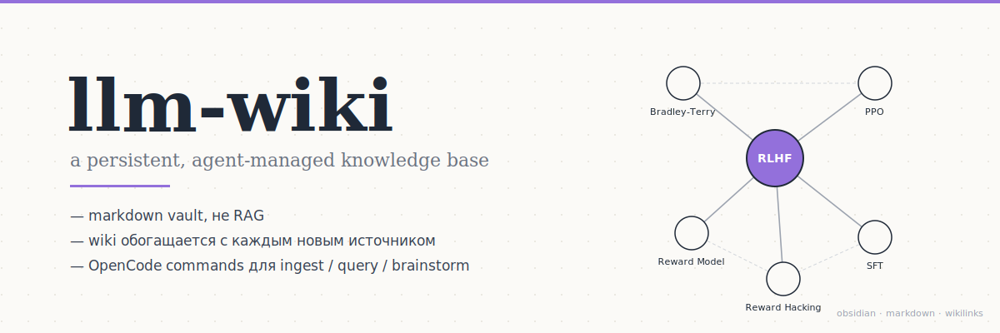

<p align="center">
  
</p>

# llm-wiki — opencode edition

Реализация паттерна **LLM Wiki** ([Andrej Karpathy](https://gist.github.com/karpathy/442a6bf555914893e9891c11519de94f)) поверх Obsidian-vault, управляемая через [OpenCode](https://opencode.ai/) CLI.

> Альтернативная реализация: тот же паттерн, что и на ветке `main` (Claude Code), но через провайдер-нейтральный opencode. Модель выбирается в `opencode.json`, по умолчанию — `openrouter/z-ai/glm-4.5-air`.

> Вместо того чтобы каждый раз заново читать сырые документы (классический RAG), LLM строит и поддерживает структурированную базу знаний — wiki из markdown-страниц с перекрёстными ссылками. С каждым источником wiki становится богаче. При запросе агент не пересинтезирует знание из чанков — он читает уже готовые страницы, где синтез был выполнен один раз при ingestion.

---

## Что внутри

| Слой | Что хранится | Кто пишет |
| --- | --- | --- |
| `raw/` | Источники: md, pdf, docx, видео-транскрипты, URL-снимки. Иммутабельно. | пользователь, `/transcribe` |
| `wiki/ideas/` | Концепции, механизмы, теории | `/ingest`, `/save` |
| `wiki/entities/` | Люди, организации, статьи, библиотеки, модели | `/ingest` |
| `wiki/domains/` | Навигационные хабы по областям (MOC), порог N=10 | `/ingest` |
| `wiki/questions/` | Сохранённые ответы из чата | `/save`, `/query` |
| `wiki/minds/` | Авторские мысли, склеенные из brainstorm-сессий | `/brainstorm` |
| `wiki/meta/` | Эмбеддинги, lint-state, knowledge-maps, дашборды — derivable | `bin/*`, `/lint`, `/kn-map` |
| `wiki/{cache,log,index,summary}.md` | Горячий контекст, журнал, каталог, обзор | команды + `bin/gen_index.py` |

Per-user контент (`raw/`, `wiki/`, `_attachments/`) исключён из репозитория. Коммитится только инфраструктура.

Полный design-doc — [`ARCHITECTURE.md`](./ARCHITECTURE.md). Схема страниц и frontmatter — [`AGENTS.md`](./AGENTS.md).

---

## Команды и subagents

OpenCode разделяет slash-команды (запуск через `/`) и subagents (вызов через `@`). Команды лежат в [`.opencode/commands/`](./.opencode/commands), агенты — в [`.opencode/agents/`](./.opencode/agents).

### Slash-команды

| Команда | Что делает |
| --- | --- |
| `/ingest` | Читает источник из `raw/` или URL, синтезирует страницы `ideas/entities`, ставит wikilinks |
| `/query` | Отвечает на вопрос из vault: cache → index → relevant pages |
| `/save` | Сохраняет ответ или инсайт из чата как wiki-страницу |
| `/brainstorm` | Модерирует мозговой штурм; склеивает permanent note (`mind`) дословно из реплик |
| `/lint` | Статические + LLM-проверки wiki, автофиксы, диалог по ask-issues |
| `/kn-map` | UMAP по семантике + force-graph по wikilinks; рендер в `wiki/meta/kn-maps/` |
| `/transcribe` | PDF/DOCX → markdown в `raw/` |

### Subagents (через `@`)

| Subagent | Что делает |
| --- | --- |
| `@defuddle` | Чистит web-страницы от nav/ads/sidebar, отдаёт markdown для url-ingest |
| `@obsidian-bases` | Создание Obsidian Bases-файлов (.base) для динамических view |
| `@obsidian-markdown` | Гайд по Obsidian-flavored markdown: wikilinks, embeds, properties |

### Авто-хуки

[`.opencode/plugins/wiki-hooks.ts`](./.opencode/plugins/wiki-hooks.ts) — Bun-плагин, после каждого turn'а агента запускает `bin/embed.py update`, `bin/gen_index.py` и `bin/gen_dashboards.py`. При компакции напоминает обновить `wiki/cache.md`.

---

## Quick start

Требуется [opencode](https://opencode.ai/), Python 3.11+ и (опционально для url-ingest) Node.

```bash
git clone <repo> && cd llm-wiki
git checkout opencode

bash bin/setup.sh           # python venv + dependencies
bash bin/setup-vault.sh     # scaffold wiki/ + raw/ директорий
npm install -g defuddle     # опционально: для /ingest <url>

# одноразовый логин в провайдер (ключ → ~/.local/share/opencode/auth.json)
opencode providers login openrouter

opencode                    # запуск агента в этой директории
```

Сменить модель — поправить `model` в `opencode.json` либо флагом `opencode -m openrouter/<provider>/<model>`. Список — `opencode models openrouter`.

Для `bin/embed.py` (отдельный embedding-пайплайн) ключ читается из `.env` в корне: `EMBED_API_KEY`, `EMBED_HOST`, `EMBED_MODEL`.

В сессии:

```
> /ingest raw/моя-статья.md
> /query что такое Bradley-Terry?
> /brainstorm бустинг моделей
> /lint
```

Wiki полностью совместима с Obsidian — открывается как обычный vault и параллельно редактируется руками.

---

## Структура репозитория

```
.opencode/       # OpenCode: agents, commands, plugins (Bun-хуки)
_templates/      # frontmatter templates: idea / entity / domain / question / mind / meta
assets/          # ассеты README (cover image)
bin/             # генераторы (embed, gen_index, knowledge_map, lint, transcribe…)
raw/             # per-user источники (gitignored)
wiki/            # per-user синтез (gitignored)
opencode.json    # конфиг: модель, permission-policy, MCP
AGENTS.md        # схема страниц, frontmatter, правила vault'а (читается opencode'ом)
ARCHITECTURE.md  # design-doc: контракты слоёв и команд
README.md
```

`bin/embed.py`, `bin/gen_index.py`, `bin/gen_dashboards.py` запускаются автоматически Bun-плагином после каждого turn'а — команды их не вызывают.

---

## Ветки

- **`main`** — реализация под Claude Code.
- **`opencode`** — эта ветка: альтернативная конфигурация под opencode CLI.

---

## Контекст

Часть ВКР по гибридному фреймворку организации знаний (иерархия + Zettelkasten + Mind Mapping). Реализация ножек:

- **иерархия** — `wiki/domains/` как MOC (map of content);
- **Zettelkasten** — `wiki/ideas/` + `wiki/entities/` + плотные wikilinks;
- **Mind Mapping** — `wiki/minds/` через `/brainstorm`.

## Лицензия

MIT
